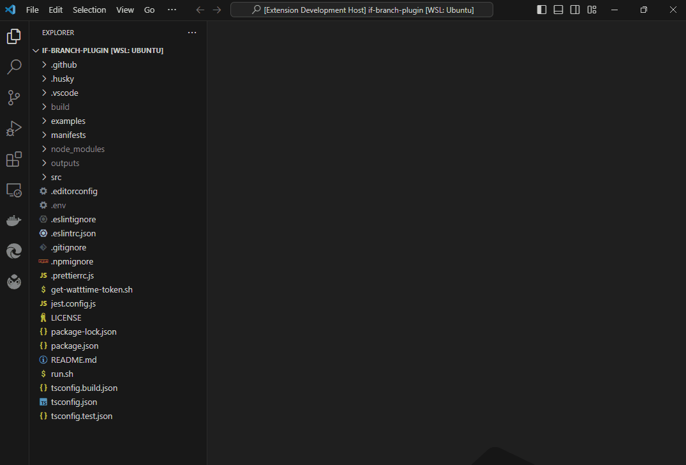
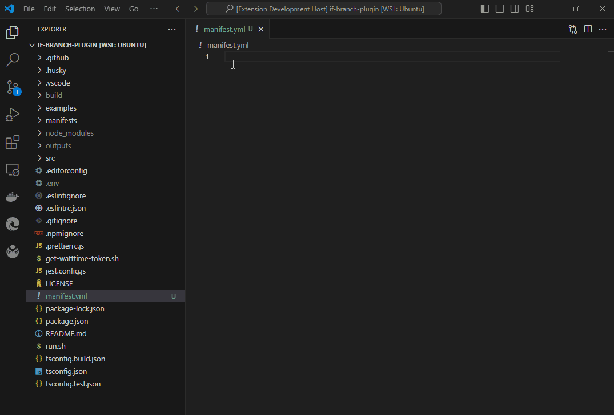
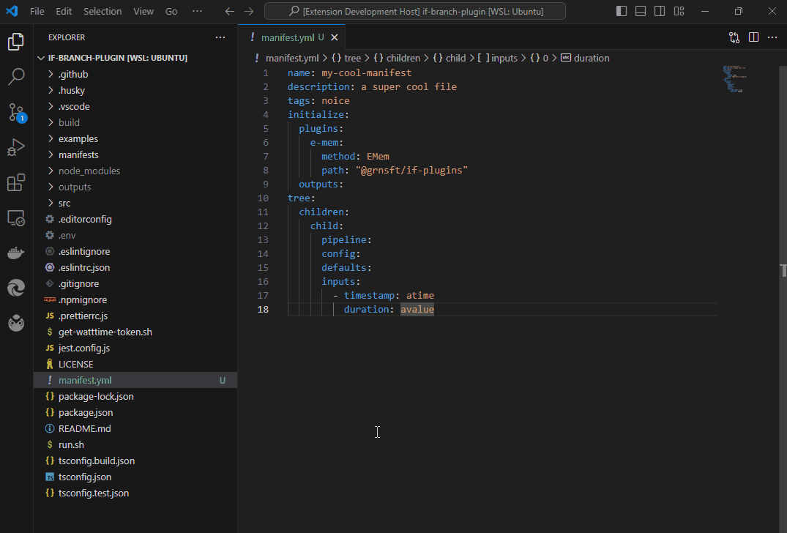
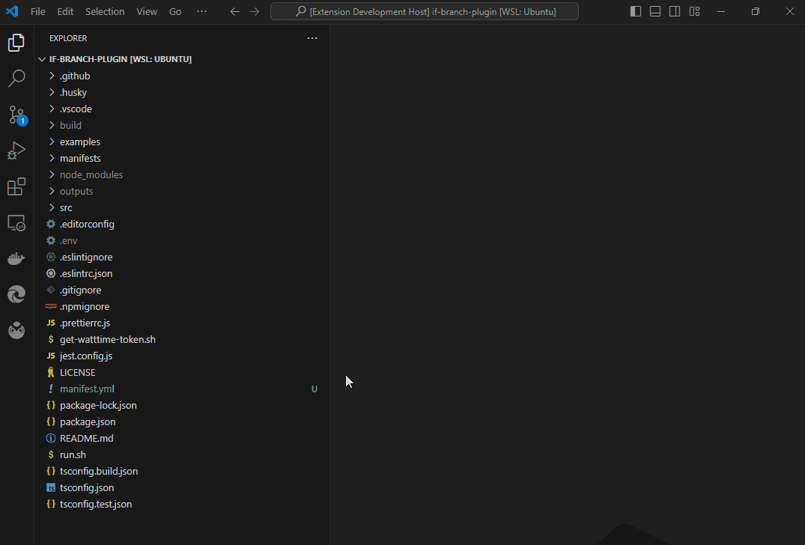

# impact-framework-vscode

A Visual Studio Code extension that makes life easier when working with the Green Software Foundation's [Impact Framework](https://if.greensoftware.foundation/).

## Features (_still under development_)

- Create new IF manifest file via vscode command. 

- Snippets to autocomplete IF manifest file sections.

- Hover-over descriptions of IF manifest file components.

- Sidebar listing available IF plugins.

## Requirements

> Not a strict requirement, but installing yaml languge support (e.g. via [YAML Extension](https://marketplace.visualstudio.com/items?itemName=redhat.vscode-yaml)) greatly improves the experience of working with IF manifest files. Without Yaml language support, some of this extension's features may not work properly (more details [here](https://github.com/andrew-woosnam/impact-framework-vscode/issues/8)).

## Installation

### Option 1:
Visit the [releases page](https://github.com/andrew-woosnam/impact-framework-vscode/releases) for a .vsix file, then either double-click it or drag & drop it directly into your VS Code editor's Extensions sidebar.

### Option 2:
Clone this repository, open the project in VS Code and press F5 to build. A second sandbox instance of VS Code (called "Extension Development Host") will open with this extension installed.

## Known Issues

We track these [here](https://github.com/andrew-woosnam/impact-framework-vscode/issues).

## Release Notes

_WIP_

